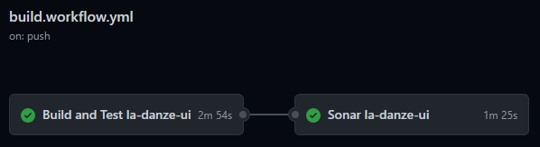
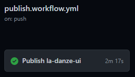

# Project organizaton

## Files structure

This project is designed as a monorepo using Yarn workspaces. There is 3 packages:
* `demo` - uses [`vite`](https://github.com/vitejs/vite) as build tool
* `doc` -  uses [`docusaurus`](https://github.com/facebook/docusaurus) as build tool
* `lib` - uses [`tsdx`](https://github.com/formium/tsdx) as build tool 
```
la-danze-ui/
|--- package.json
|--- ...
|--- packages/
     |--- demo/
          |--- package.json
          |--- ...
     |--- doc/
          |--- package.json
          |--- ...
     |--- lib/
          |--- package.json
          |--- ...
```


## NPM scripts

All commands below must be launched from root of project (See [package.json](package.json)). 

### Lib package

* `yarn build:lib` - build lib
* `yarn test:lib` - test lib
* `yarn test:ci:lib` - same as `yarn test:lib` with specific options for ci
  
### Demo package

* `yarn dev:demo` - dev (start) demo
* `yarn build:demo` - build demo
* `yarn serve:demo` - serve demo with build result files

### Doc package

* `yarn dev:doc` - dev (start) doc
* `yarn build:doc` - build doc
* `yarn serve:doc` - serve doc with build result files

### Common

* `yarn build` - build lib, demo and doc
* `yarn deploy` - deploy doc and demo to github pages

## Github Actions

There are 2 workflows:
* [`build.workflow.yml`](workflows/build.workflow.yml) - launched on every push, expect for tags, .md files excluded (See [pipeline](https://github.com/pchmn/la-danze-ui/actions?query=workflow%3A%22Build+and+Test%22))
  * **Build la-danze-ui**: build library and test it with coverage
  * **Sonar la-danze-ui**: run sonar cloud on library



* [`publish.workflow.yml`](workflows/publish.workflow.yml) - launched only on tags push (See [pipeline](https://github.com/pchmn/la-danze-ui/actions?query=workflow%3APublish+))
  * **Publish la-danze-ui**: build library and publish it to npm

